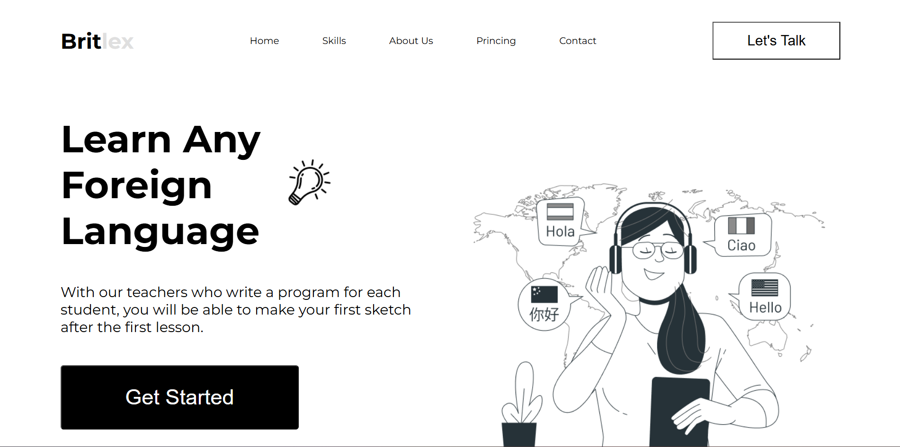

# 📚 Lessons Page

A simple **responsive website** built with **HTML** and **CSS**.  
This project was created for practice and to demonstrate basic front-end development skills.

[]()
[]()
[]()

---

## 🌐 Live Demo
🔗 [View Lessons Page](https://meruj2333.github.io/Lessons-page/)

---

## 📸 Preview



---

## ✨ Features
- 📱 **Responsive layout** (works on desktop and mobile)
- 🎨 Clean and simple design
- 📑 Sections: *Home, Skills, About Us, Pricing, Contact*

---

## 🛠️ Technologies Used
- **HTML5**
- **CSS3**

---

## 🚀 How to Use
1. Clone or download this repository
2. Open `index.html` in your browser

## 🤝 Connect with me

[](https://github.com/Meruj2333)
[](https://www.linkedin.com/in/meruj-harutyunyan-80b52135b/)

```bash
git clone https://github.com/Meruj2333/Lessons-page.git
cd Lessons-page